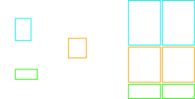

# figure-inset

`figure-inset` is a command-line tool to generate SVG figures with insets and potential labels from a very simple SVG input that can be trivially edited using SVG editing tools such as [Inkscape](https://inkscape.org). The input file must consist on an image with several unfilled rectangles, preferrably with different border colors, marking where do you wants the insets to be taken. An example of such input SVG is:


Help can be found by invoking `figure-inset --help`, which shows:

```
figure-inset      - figure inset generator.
   Parameters:
   --help - Show this help
   --input=<input> - The input svg file with an image and several rectangles that mark the insets. If omitted, it is obtained from the standard input.
   --output=<output> - The output svg file with the new insets. If omitted, the standard output.
   --images <image1> <image2> <image3> - The filenames of the images for the insets, added to the image in the SVG file.
   --labels <label1> <label2> <label3> - Label associated with each filename. Not displayed if omitted
   --ignore-image-in-svg - Boolean, ignores the image in the SVG and only uses the one in the --images parameter
   --layout-type=<layout> - The distribution of the insets, one of the following:
        layout-horizontal-images-bottom-insets layout-single-image-bottom-insets layout-single-image-right-insets 
```

## Layouts

Here you can find the output for different layouts with the previous input image:





outputs








outputs






outputs


