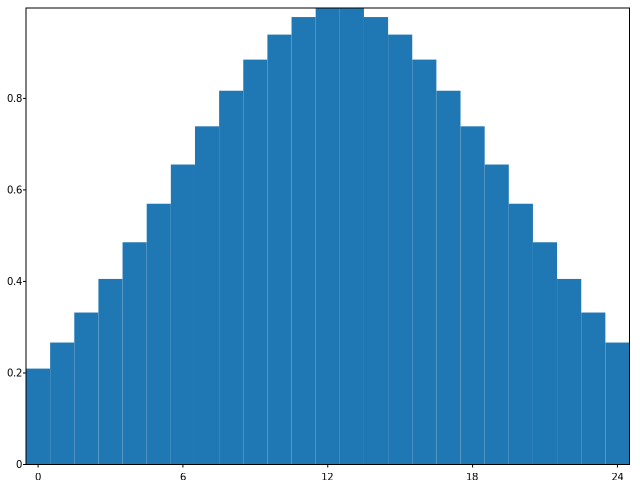
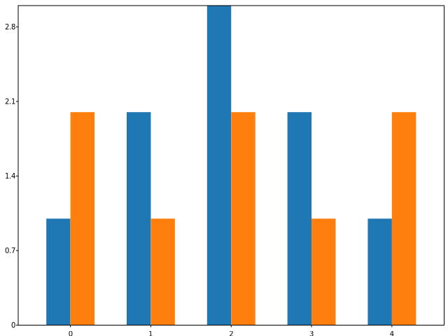
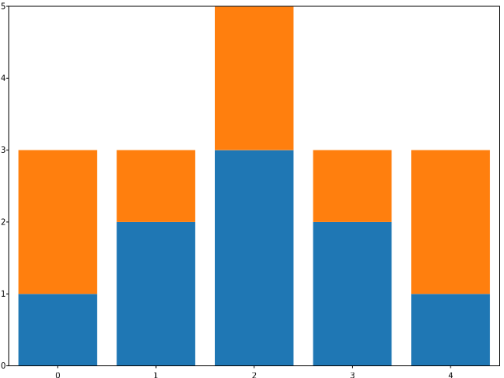
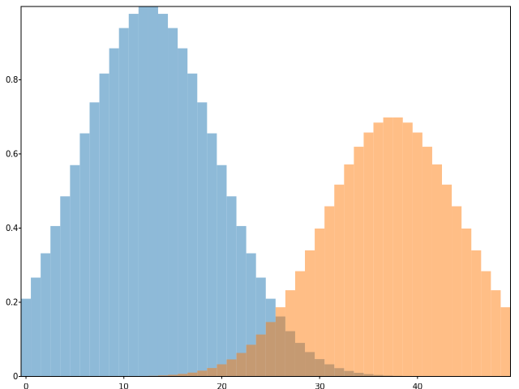
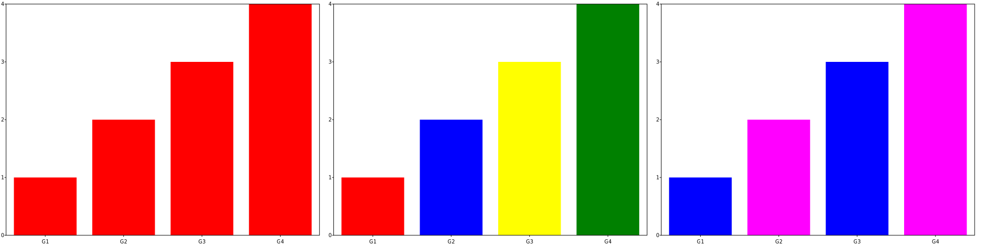
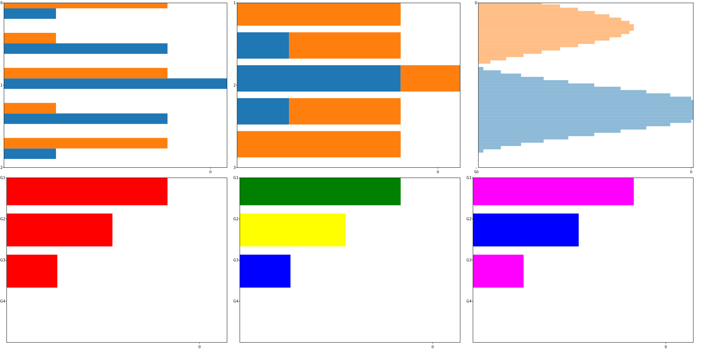

# SVGPlot::bar

The `bar` method provides a simple way of generating bar diagrams from the `svg::plot::SVGPlot` class:





The `bar` method expects two parameters that are vectors (or any collection type) of preferrably the same size: 
- the center positions of the bars on the *x*-axis
- the height of each of the bars

However, the first parameter can also be a collection of strings, hence becoming a shortcut for naming the `xticks` of the plot adequately. The above example is basically a shortcut for





Both generate the same diagram:


Of course the `bar()` method is not limited to bracketed lists. It can also work with any STL linear container of floating point numbers (such as `std::list<float>`). Additionaly, a python-like `arange(<start>,<stop>,<step>)` is provided as a list generator. These are illustrated in the following code:






The code above also ilustrates the named parameter `width` that set ups the width of all the bars. If instead of a floating point number a vector / container is passed as parameter, it can actually set up different widths for each bar. The result of the above source code is the following:



## Combining several bars

There are several ways of combining different bars in the same diagram. The first option is to have side-by-side bars. In order to do so, the `width` of each of them must be obviosly smaller and you need to put each of them at different *x*-axis positions but at the same interval. For that purpose, the `arange(<start>,<stop>,<step>)` provides operators (`+`, `-`, `*`, `/`) with floating point numbers. All these can be seen in the following example: 






that generates 



Another option is to have *cumulative* bars. For that, the `bottom` named parameter (which in C++ is modeled as a method) can set different *y*-axis positions for the bottom of each bar, and hence can also be used to define where one of the bar stops and the other starts:




 
generating the following graph:


 
The last proposed option is to used transparency, modeled by the named attribute `alpha`, which is used as follows:






and obtains 


 
## Formatting

Bars can be formatted with different colors, taking advantage of the `color` named attribute (represented as a method). Colors are strings:
- Single character strings represent basic colors (```r```  red, ```g```  green, ```b```  blue, ```c``` cyan, ```m``` magenta, ```y```  yellow, ```k```  black, ```w``` white)
- Strings that start with a '#' symbol are considered to be hexadecimal url defined colors.
- Otherwise, the color is considered to be one of the [SVG named colors](https://www.december.com/html/spec/colorsvgsvg.html).

If only one color is set, then it affects all the bars, but also a single color can be applied to every single bar by passing a linear container of colors. If several colors are setup but there are more data bars, then it cycles through all the colors. All these options are illustrated in the following example:






that yields the same bars with different coloring strategies:



## Horizontal bars

In the same way that the `bar` method provides a way to generate **vertical** bar graphs, the `barh` method provides a way to generate **horizontal** graph bars, which works very similarly with minor changes:
- The parameters correspond to the *y* positions and widths as opposed to *x* positions and heights (but in practice they are set up similarly.
- The named parameter `height` becomes `width`, with a similar behavior.
- The named parameter `bottom` becomes `left`, with a similar behavior.
- The rest of named parameters is unchanged.

The following example reproduces most of the above examples but with horizontal graph bars:





leading to the following output:


