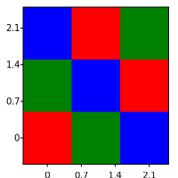
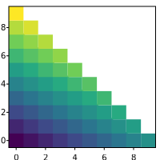
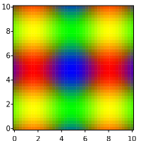

# SVGPlot::imshow

The `imshow` method provides a versatile way of plotting two dimensional data from the `svg::plot::SVGPlot` class. Particularly, it is able to plot images given a two dimensional array (array of array) of colors. This can be done as typed colors





or as strings that name colors





For more details about how to express colors, see [here](colors.html)  

These generate



Alternatively, it is also possible to pass four-dimensional arrays as color values:





In that case, the first three components correspond to the RGB color while the fourth component becomes the opacity, as shown here:


Last, it is also possible to pass only floating point values instead of colors:





which are converted to colors using color maps. The code above is transformed into:


In general, it is possible to pass arrays as "colors", and the behavior depends on the size of those arrays:
* 1D arrays are transformed into values from their only component and then go through the color map.
* 2D arrays are split: the first component goes through the color map and the seconds becomes the opacity.
* 3D arrays become RGB colors.
* 4D arrays begome RGB colors (first three components) and an opacity (fourth component) as discussed above.

While the typical `imshow` call would expect that the width of each line is equal to the others, in practice there is no need. Empty positions will just become transparent. For instance, this code:





yields this graph:



 
There is also the possiblity of passing a two dimensional funcion with two lists of positions (in the two axes) to evaluate. The return value of that function can be any of those that can be passed also as vectors, such as single floating point values, colors or (1-2-3-4)D arrays. The following code illustrates how to use this:





This code generates



## Formatting

### Extent

The `extent` named attribute, which in C++ is modeled as a method that can be concatenated with other similar methods, defines the actual range covered by the `imshow` data as a 4D array {xmin,xmax,ymin,ymax}. This is useful for adjusting the x-y labels according to the adequate range. For instance the following code





yields the following graph


Note how the range of the data defined by the list covers the \[0..1\] range in the horizontal axis (instead of the \[0..100\] which would be setup according to the number of data points). 

This attribute also helps locating the data into specific positions within a larger plot. It also enables flipping any of the axis by switching the minimum and maximum on that axis. An example of that is given by 





that results into 


Note how the RGB data is centered and flipped on the vertical axis.

In the case of data defined by a 2D function (see example
 above) the extent of the data is already defined as the boundaries of the function.

### Colormaps and limits for values

In the case of arrays of values, the mapping to RGB values is done (like in Matplotlib) through a color map, where the maximum and minimum labeled values are calculated automatically from the data so there is no clamping.

It is possible, however, to specifically set those clamping values through the `vmin` and `vmax` named parameters (represented in C++ as methods). Those parameters can even be inverted (`vmin` being greater than `vmax`) so that the colormap is inverted as well. These options are illustrated in the following example, where several options regarding `vmin` and `vmax` are compared.





This example yields the following result:


 
It is also possible to change the color map through the `cmap` attribute: a string that defines the mapping from the values to a color that represents them. More about color maps can be read [here](colormaps.html).

The `vmin`, `vmax` and `cmap` named attributes have no effect on `imshow` when the input data consists on colors, or has three or four channels (which internally translate into colors).


**FROM THIS POINT EVERYTHING IS OLD AND WORK IN PROGRESS**

### Interpolation

It is possible to define different strategies for interpolation, defined as a C++ equivalent of a named attribute. By default the interpolation is `"nearest"` (used in all the examples above), which means that there is no interpolation between the values. This library offers another interpolation option, `"bicubic"`, but with two limitations:
- RGBA values are not supported in bicubuc interpolation.
- The library has to be complied and linked with `libpng`.

This would be an example of bicubic interpolation:

```cpp
svg::plot::SVGPlot plt;
plt.figsize({200,200});
auto f = [] (float x, float y) {
    float r = 0.5f+0.5f*std::sin(x);
    float g = 0.5f+0.5f*std::sin(y);
    float b = std::max(0.0f,1.0f-(r+g));
    return std::tuple(r,g,b);
};
plt.imshow(svg::plot::arange(0,10,0.25),svg::plot::arange(0,10,0.25),f).interpolation("bicubic");
plt.savefig("../doc/svgplot/imshow/example6.svg");
```

that generates a much smoother output

<div style="text-align:center"></div>

