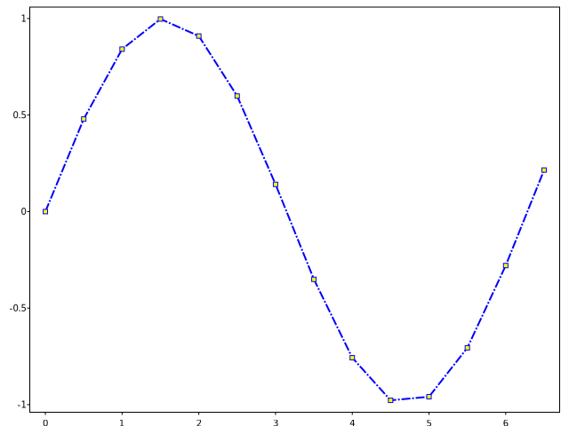
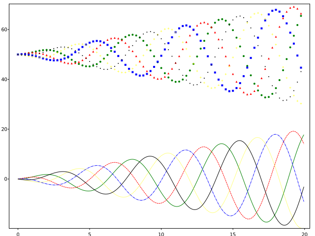

# SVGPlot::plot

The `plot` method provides a versatile and fast way of plotting graphs and curves from the `svg_cpp_plot::SVGPlot` class. Generating visualizations is very quick:





generates the following graph:


	
You may be wondering why the x-axis ranges from *0-3* and the *y*-axis from *1-4*. If you provide a single list or array to the `plot()` method, it is assumed that it represents a sequence of *y* values, and automatically generates the *x* values for you, starting from *0* (in this case `{0, 1, 2, 3}`).

`plot()` is a versatile method. For example, to plot *x* versus *y*, you can do





to include also specific values on the *x* axis and therefore generate


Of course the `plot()` method is not limited to bracketed lists. It can also work with any STL linear container of floating point numbers (such as `std::list<float>`). Additionaly, a python-like `arange(<start>,<stop>,<step>)` is provided as a list generator. These are illustrated in the following code:






that generates 


Furthermore, it is also possible to use functions as the *y* parameter. In that case, the function is evaluated for all the real numbers in *x* and plotted accordingly, as follows:






The above example also illustrates the provided python-like `linspace(<start>,<stop>,<nsamples=50>)` list generator. It generates the following graph:


## Formatting

There are several *named attributes* that can be used for formatting the plot. However, as C++ does not specifically support such feature, these named attributes are implemented as postfix methods, appended consecutively at the end of the `plot` method call.

These are this named attributes:
- `markersize(<float>)` sets the size of the marker.
- `marker(<string>)` defines the style of the marker represented as a single charater (the same characters as for [scatter plots](scatter.html)).
- `markeredgewidth(<float>)` sets the width of the line around the markers.
- `linewidth(<float>)` sets the width of the line.
- `linestyle(<string>)` defines the style of the line (```-``` full line, ```--``` dashed line, ```-.``` chain line, ```..``` small dashed line). Alternatively, it is also possible to pass a list of floats indicating the size of the lines and spaces among them, consecutively.
- `color(<color>)` defines the [color](color.html) of the plot.
- `markerfacecolor(<color>)` defines the [color](color.html) of the markers.
- `markeredgecolor(<color>)` defined the [color](color.html) of the edges of the markes.

As an usage example for these parameters, we provide this:





which yields the following graph:


Alternatively, it is possible to use *format strings*, structured as 

```
"[marker][line][color]"
```

Each of them is optional. If not provided, a default value (alternating so it actually changes from plot to plout) is used. The exceptions are the interactions between lines and markers: If `line` is given, but no `marker`, the data will be a line without markers, and if `marker` is given but no `line`, the data will be markers without lines.

Other combinations such as `[color][marker][line]` are also supported, but note that their parsing may be ambiguous.

The `fmt` can be either a named attribute or also a nameless attribute added at the end of the data, as illustrated in the following example: 





which gives the following output:
